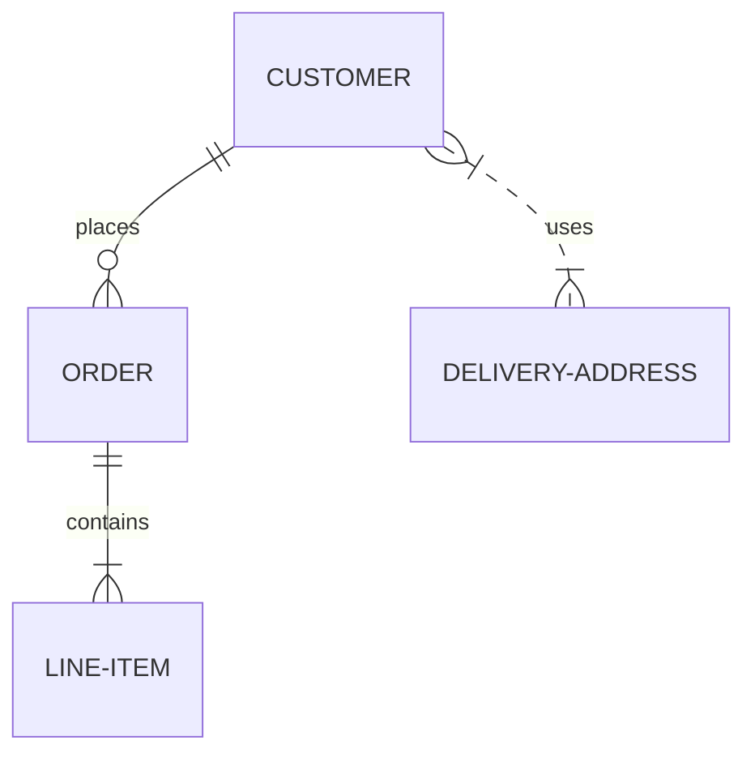

```
Первый вариант вставки ссылок - это просто написать адрес сайта http://sabaka.net

Второй вариант записывается так: `[текст ссылки](адрес ссылки)`
```
[sabaka.net](http://sabaka.net)
```
[sabaka.net](http://sabaka.net)
    
[Sabaka(DOT)Net]:http://sabaka.net    
    
[:arrow_up:Оглавление](#Оглавление)
____
## Вставка изображения
```

```


### Дополнительно:
#### Вставка ссылки с картинкой на ролик с YouTube
Описание комбинации `[](ссылка на страничку YouTube)`        
Пример:        
```[](https://youtu.be/RHPYGwVQB2o)```        
Что мы увидим:        
[](https://youtu.be/RHPYGwVQB2o)        
        
[:arrow_up:Оглавление](#Оглавление) 
____
## Вставка таблиц
```
| LEFT | CENTER | RIGHT |
|----------------|:---------:|----------------:|
| По левому краю | По центру | По правому краю |
| текст | текст | текст |
```
| LEFT | CENTER | RIGHT |
|----------------|:---------:|----------------:|
| По левому краю | По центру | По правому краю |
| текст | текст | текст |

**Внимание:** Если в тексте таблицы нужно использовать символ "вертикальная черта - `|`", то в место него необходимо написать замену на комбинацию HTML-кода* `&#124;`, это нужно для того, что бы таблица не потеряла ориентации.    
*) - Можно использовать ASCII и/или UTF коды.

**Пример:**
```
| Обозначение | Описание | Пример регулярного выражения|
|----:|:----:|:----------|
| literal | Строка содержит символьный литерал literal | foo |
| re1&#124;re2 | Строка содержит регулярные выражения `rel` или `re2` | foo&#124;bar |
```
**Результат:**

| Обозначение | Описание | Пример регулярного выражения|
|----:|:----:|:----------|
| literal | Строка содержит символьный литерал literal | foo |
| re1&#124;re2 | Строка содержит регулярные выражения `rel` или `re2` | foo&#124;bar |

[:arrow_up:Оглавление](#Оглавление) 
____
## Диаграмм Mermaid.js
Появилась возможность вставлять диаграммы [Mermaid.js](https://mermaid-js.github.io/mermaid/#/)

<pre>
```mermaid
... код диаграммы ...
```
</pre>
Пример:
<pre>

</pre>

Очень подробно на русском языке о диаграммах Mermaid.js: https://habr.com/ru/post/652867/ 

[:arrow_up:Оглавление](#Оглавление) 
____

